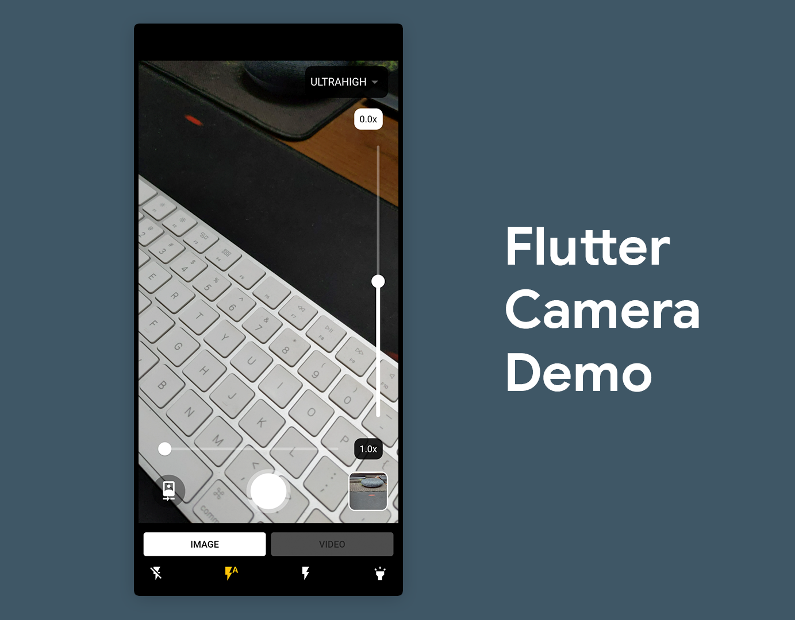

# Flutter Camera Demo

A full-fledged camera app built with Flutter using the [camera](https://pub.dev/packages/camera) package. You can even add custom features to this app and customize the user interface to match your app’s design palette.

The app contains most of the basic camera features, including:

- Capture quality selector
- Zoom control
- Exposure control
- Flash mode selector
- Button for flipping the camera — rear cam to front cam and vice versa
- Button for capturing an image
- Toggle for shifting from image mode to video mode
- Video mode controls — start, pause, resume, stop
- Last captured image or video preview
- Retrieve the image/video files

## Packages

The packages that are used to build this app are as follows, add them to your `pubspec.yaml` file:

- [camera](https://pub.dev/packages/camera): provides cross-platform APIs for implementing the camera functionalities
- [video_player](https://pub.dev/packages/video_player): for previewing the captured videos
- [path_provider](https://pub.dev/packages/path_provider): for storing the images or videos inside a directory from where they can be easily accessed

## License

Copyright (c) 2021 Souvik Biswas

Permission is hereby granted, free of charge, to any person obtaining a copy
of this software and associated documentation files (the "Software"), to deal
in the Software without restriction, including without limitation the rights
to use, copy, modify, merge, publish, distribute, sublicense, and/or sell
copies of the Software, and to permit persons to whom the Software is
furnished to do so, subject to the following conditions:

The above copyright notice and this permission notice shall be included in all
copies or substantial portions of the Software.

THE SOFTWARE IS PROVIDED "AS IS", WITHOUT WARRANTY OF ANY KIND, EXPRESS OR
IMPLIED, INCLUDING BUT NOT LIMITED TO THE WARRANTIES OF MERCHANTABILITY,
FITNESS FOR A PARTICULAR PURPOSE AND NONINFRINGEMENT. IN NO EVENT SHALL THE
AUTHORS OR COPYRIGHT HOLDERS BE LIABLE FOR ANY CLAIM, DAMAGES OR OTHER
LIABILITY, WHETHER IN AN ACTION OF CONTRACT, TORT OR OTHERWISE, ARISING FROM,
OUT OF OR IN CONNECTION WITH THE SOFTWARE OR THE USE OR OTHER DEALINGS IN THE
SOFTWARE.
